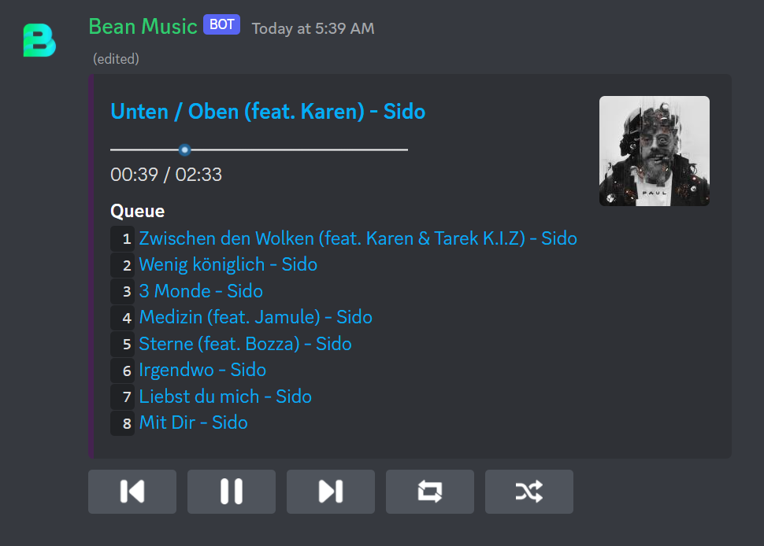
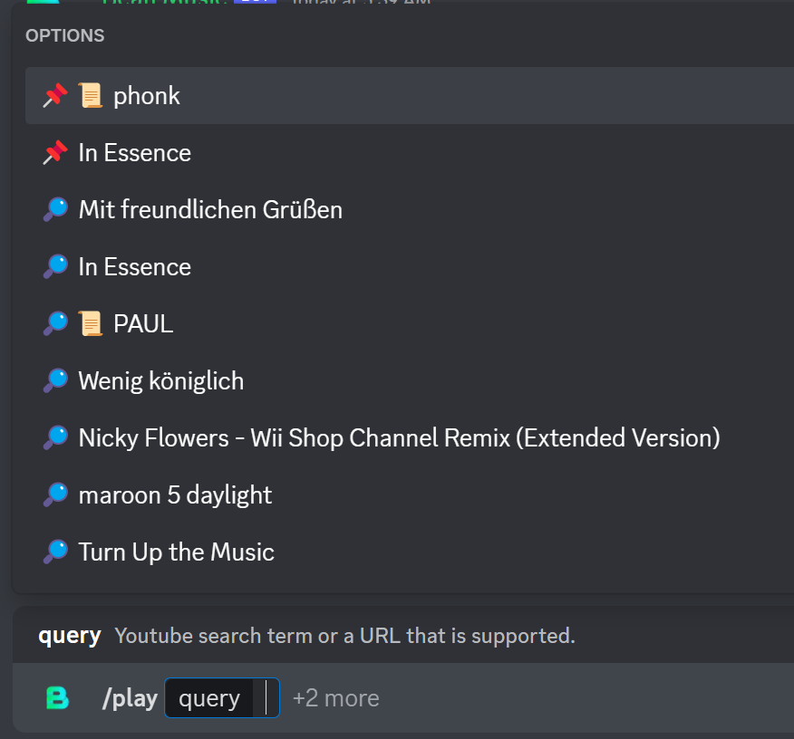

### This branch has music functionality that's removed from the main bot
### In order to use this, you need to selfhost it by downloading the source and building it yourself.

### Build

#### 1. Clone Repository

```bash
git clone -b music --single-branch https://github.com/Xirado/Bean
cd Bean
```

#### 2. Building

Run `./gradlew build` (`.\gradlew build` if on Windows)
(Make sure to Java >= 16 in your PATH and JAVA_HOME env variable set too!)

### 3. Configuration

Example `config.json` that goes in the same directory as the `.jar`

```json
{
  "token": "<Your Discord Bot Token>",
  "database" : { // MariaDB credentials, needed for the bot to function
    "host": "localhost",
    "database": "bean_music",
    "username": "bean_music",
    "password": "pw",
    "port": 3306
  },
  "youtube": { // You need this if you want to listen to 18+ YT Vids
    "email": "email",
    "password": "password"
  },
  "spotify": { // https://developer.spotify.com/dashboard/
    "client_id": "<CLIENT_ID>",
    "client_secret": "<CLIENT_SECRET>"
  },
  "deezer_key": "DEEZER_MASTER_DECRYPTION_KEY" // You need to find this yourself
}
```

#### 4. Running

Run `build/libs/Bean.jar`
