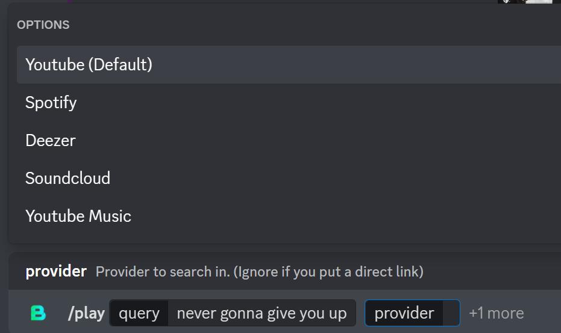

### This branch has music functionality that's removed from the main bot
### In order to use this, you need to selfhost it by downloading the source and building it yourself.

### Build

#### 1. Clone Repository

```bash
git clone -b music --single-branch https://github.com/Xirado/Bean
cd Bean
```

#### 2. Building

Run `./gradlew build` (`.\gradlew build` if on Windows)
(Make sure to Java >= 16 in your PATH and JAVA_HOME env variable set too!)

#### 3. Running

Run `build/libs/Bean.jar`
